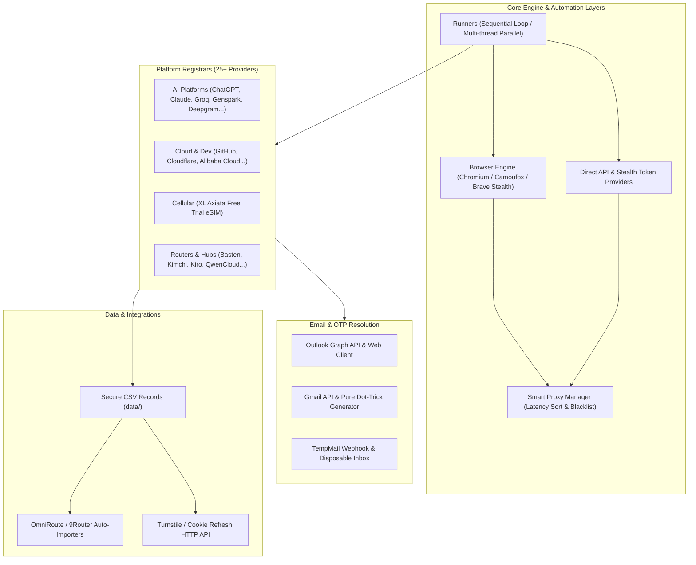

# Super Power Automation

Enterprise-grade automated account registration, session token harvesting, and credential provisioning platform powered by Playwright, Camoufox Anti-Detect, Direct API emulators, and intelligent email automation.

---

## 🚀 Ringkasan & Arsitektur Sistem

Platform ini dirancang untuk menjalankan otomatisasi registrasi akun secara masal (*mass registration*), rotasi proxy cerdas, bypass proteksi anti-bot (Cloudflare Turnstile, reCAPTCHA v2/v3, Arkose Labs, Alibaba Slider), ekstraksi session/cookies/API keys, dan integrasi langsung ke aggregator seperti **OmniRoute** dan **9Router**.



---

## 📋 Matriks Platform yang Didukung

### 1. Artificial Intelligence & LLM Services
| Platform | Registrasi Tunggal | Mode Loop | Mode Paralel | Integrasi Email / Token |
| :--- | :--- | :--- | :--- | :--- |
| **ChatGPT** | `npm run chatgpt` | `npm run loop:chatgpt` | `npm run parallel:chatgpt` | Outlook & TempMail + Session Cookie Refresher |
| **Claude** | `node registrars/register_claude.mjs` | `node runners/loop.js registrars/register_claude.mjs` | Multi-tab | Email OTP + Anti-detect |
| **Genspark AI** | `npm run genspark` | `npm run loop:genspark` | `npm run parallel:genspark` | Email OTP + Fair Proxy Rotation |
| **Groq Cloud** | `npm run groq` | `npm run loop:groq` | `npm run parallel:groq` | Direct Email atau GitHub OAuth (`--github`) |
| **Grok (xAI)** | `npm run grok` | `npm run loop:grok` | `npm run parallel:grok` | Email verification flow |
| **Deepgram** | `npm run deepgram` | `node runners/loop.js registrars/register_deepgram.js` | `npm run parallel:deepgram` | Auto API Key generation |
| **ElevenLabs** | `npm run elevenlabs` | `node runners/loop.js registrars/register_elevenlabs.js` | - | Voice AI API Key provisioning |
| **Mistral AI** | `npm run mistral` | `npm run loop:mistral` | - | API Key generation & activation |
| **Meta Llama** | `node registrars/register_meta.js` | `npm run loop:meta` | `npm run parallel:meta` | Enterprise registration pipeline |
| **Qwen / QwenCloud** | `npm run qwencloud` | `npm run loop:qwencloud` | - | Alibaba Bailian/ModelStudio API extraction |
| **OpenModel** | `npm run openmodel` | - | - | Auto-captcha solving |
| **OpenRouter** | `npm run openrouter` | - | - | API key generator |

### 2. Cloud, Developer Infrastructure & Tools
| Platform | Registrasi Tunggal | Mode Loop | Mode Paralel | Keterangan |
| :--- | :--- | :--- | :--- | :--- |
| **GitHub** | `npm run github` | `npm run loop:github` | `npm run parallel:github` | Dukungan Outlook signup & dot-trick aliases |
| **Cloudflare** | `npm run cloudflare` | `npm run loop:cloudflare` | `npm run parallel:cloudflare` | Turnstile bypass & Global API Key fetch |
| **Alibaba Cloud** | `npm run alibaba` | - | - | Auto-drag Baxia puzzle captcha |
| **Codebuddy** | `npm run codebuddy` | `npm run loop:codebuddy` | - | Integrasi via GitHub (`--github`) atau Outlook |
| **Bitdeer** | `npm run bitdeer` | - | `npm run parallel:bitdeer` | Cloud compute infrastructure |
| **Microsoft Outlook**| `npm run outlook` | `npm run loop:outlook` | `npm run parallel:outlook` | Pembuatan akun Outlook & verifikasi Graph API |

### 3. Telekomunikasi & Seluler
| Platform | Registrasi Tunggal | Mode Loop | Mode Paralel | Keterangan |
| :--- | :--- | :--- | :--- | :--- |
| **XL Axiata Free Trial eSIM** | `npm run xl:esim:single` | `npm run loop:xl:esim` | `npm run xl:esim` | **Direct API** + Stealth reCAPTCHA provider. Ekstraksi otomatis Nomor eSIM, PUK, Activation Code & file gambar QR Code resmi. |
| **XL eSIM (Gmail Mode)** | `npm run xl:esim:single:gmail` | `npm run loop:xl:esim:gmail` | `npm run xl:esim:gmail` | Pendaftaran via Gmail API + algoritma Pure Dot-Trick. |

### 4. Router & Token Aggregators
| Platform | Script Registrar | Script Import OmniRoute / 9Router |
| :--- | :--- | :--- |
| **Basten** | `npm run basten` (`--github`) | `npm run omniroute:import-basten` |
| **Kimchi** | `npm run kimchi` | `npm run omniroute:import-kimchi` |
| **Kiro** | `npm run kiro` | `npm run omniroute:import-kiro` & `npm run import:github:kiro` |
| **Tokeness / Tokengo / Tokenharbor** | `npm run tokeness` / `tokengo` / `tokenharbor` | Ekstraksi token sesi ke CSV |
| **Xiaomi MiMo API** | `npm run register` | Auto 2captcha / LLM Vision captcha |
| **Qoder** | `npm run qoder` | Routing via platform aggregator |

---

## 🛠️ Persyaratan Sistem & Instalasi

### Prasyarat
* **Node.js**: v18.x atau yang lebih baru (disarankan v20+)
* **NPM**: v9.x+
* **OS**: Linux (Ubuntu/Debian didukung penuh), macOS, atau Windows (WSL2)
* **Playwright Dependencies**: Browser Chromium terpasang

### Langkah Instalasi
```bash
# 1. Clone repositori
git clone git@github.com:trianggianggara/super-power-automation.git
cd super-power-automation

# 2. Pasang dependencies
npm install

# 3. Unduh runtime browser Playwright
npx playwright install chromium

# 4. Salin template konfigurasi environment
cp .env.example .env
```

---

## ⚙️ Konfigurasi Environment (`.env`)

Sesuaikan variabel di file `.env` sesuai kebutuhan operasional:

```env
# ==============================================================================
# Browser & Anti-Detect
# ==============================================================================
# Path kustom browser (Google Chrome, Brave, atau Camoufox). Dikosongkan = auto-detect.
BROWSER_EXECUTABLE_PATH=
HEADLESS=true
LAUNCH_TIMEOUT_MS=30000
STEP_TIMEOUT_MS=60000

# ==============================================================================
# Koneksi & Proxy Management
# ==============================================================================
# Proxy tunggal (opsional) atau kosongkan untuk menggunakan http_proxies.txt
PROXY=
DISABLE_PROXY=false
PROXY_MAX_LATENCY_MS=3000
PROXY_CHECK_CONCURRENCY=150

# ==============================================================================
# Solver Captcha (Vision LLM / 2Captcha)
# ==============================================================================
LLM_API_KEY=your_openai_or_openrouter_key
LLM_API_URL=https://api.openai.com/v1/chat/completions
LLM_MODEL=gpt-4o-mini
TWO_CAPTCHA_KEY=

# ==============================================================================
# Integrasi Microsoft Graph / Outlook
# ==============================================================================
OUTLOOK_CLIENT_ID=a48e86c0-e508-4b09-9d69-f735792ed3e3
OUTLOOK_CLIENT_SECRET=
OUTLOOK_ENABLE_RECOVERY_EMAIL=true

# ==============================================================================
# Integrasi Gmail API (OAuth2 untuk Mode Dot-Trick)
# ==============================================================================
GMAIL_USER=admin1@gmail.com,admin2@gmail.com
GMAIL_CLIENT_ID=your_client_id.apps.googleusercontent.com
GMAIL_CLIENT_SECRET=your_client_secret
GMAIL_REFRESH_TOKEN=token1,token2

# ==============================================================================
# OmniRoute & Aggregator Sync
# ==============================================================================
OMNIROUTE_URL=http://localhost:20128
OMNIROUTE_PASSWORD=your_dashboard_password

# ==============================================================================
# Kredensial Default
# ==============================================================================
PASSWORD=SuperPowerAuto2026!#
```

---

## 📖 Panduan Penggunaan & Perintah Utama

### 1. XL Axiata Free Trial eSIM
Registrar XL eSIM menggunakan arsitektur **Direct API** yang cepat, andal, dan meminimalkan penggunaan resource browser:

```bash
# Registrasi single account (koneksi direct)
npm run xl:esim:single

# Registrasi 3 thread paralel (koneksi direct)
npm run xl:esim

# Registrasi menggunakan Gmail Dot-Trick
npm run xl:esim:single:gmail

# Registrasi paralel menggunakan Gmail Dot-Trick
npm run xl:esim:gmail

# Menjalankan loop tanpa henti dengan auto-restart
npm run loop:xl:esim

# Menarik file gambar QR Code, PUK, dan Activation Code dari inbox Outlook & Gmail
npm run xl:esim:fetch-qr

# Scan ulang seluruh akun (termasuk yang belum terdaftar di CSV)
npm run xl:esim:fetch-qr:all

# Paksa unduh ulang semua QR Code
npm run xl:esim:fetch-qr:force
```
> **Output CSV**: `data/xl_esim/xl_esim_accounts.csv`  
> **Output QR Code**: `data/xl_esim/qrcode_<nomor>.png`

---

### 2. ChatGPT Automation Suite
Mendukung registrasi akun baru, rotasi cookie sesi, dan expose service via API:

```bash
# Registrasi akun ChatGPT via TempMail (default)
npm run chatgpt

# Registrasi akun ChatGPT via Outlook
npm run chatgpt:outlook

# Loop pendaftaran akun ChatGPT secara berkelanjutan
npm run loop:chatgpt

# Refresh cookies session ChatGPT dari CSV data/chatgpt.csv
npm run chatgpt:refresh

# Refresh cookies ChatGPT secara headless dan tanpa proxy
npm run chatgpt:refresh:headless

# Hanya refresh token yang sudah expired
npm run chatgpt:refresh:expired

# Sinkronisasi update cookies ke dashboard OmniRoute
npm run omniroute:update-chatgpt

# Menjalankan API Server Turnstile Solver & Cookie Refresher (Port 3001)
npm run solver:api
```

---

### 3. GitHub & Outlook Ecosystem
```bash
# Registrasi akun Outlook baru
npm run outlook

# Loop pembuatan akun Outlook dengan email recovery
npm run loop:outlook:recovery

# Registrasi akun GitHub menggunakan Outlook
npm run github:outlook

# Verifikasi status aktif akun GitHub
npm run github:check
```

---

### 4. Smart Proxy Harvester & Health Monitor
Tool bawaan untuk mengumpulkan, menguji latensi, dan memvalidasi proxy terhadap endpoint target spesifik:

```bash
# Menguji & menyaring proxy untuk seluruh service
npm run proxy:fetch:all

# Menguji proxy khusus endpoint ChatGPT
npm run proxy:fetch:chatgpt

# Menguji proxy khusus endpoint XL Axiata
npm run proxy:fetch:xl

# Menguji proxy khusus endpoint GitHub
npm run proxy:fetch:github
```

---

## 🛡️ Fitur Unggulan Engine

### 1. Runner Loop dengan Auto-Cooldown ([runners/loop.js](file:///home/bayu/Project/super-power-automation/runners/loop.js))
* **Proteksi Kegagalan Beruntun**: Jika runner mengalami error 3x berturut-turut, sistem otomatis memasuki masa **cooldown selama 3 menit** untuk memulihkan koneksi dan IP address.
* **Exit Code Handler**:
  * `Code 0`: Sukses, jeda dinamis 5–10 detik.
  * `Code 77`: Terdeteksi challenge/captcha ketat, cooldown 3 menit.
  * `Code 88`: Terkena rate-limit platform, cooldown 5 menit.
  * `Code 99`: Semua akun target selesai diproses, standby idle container.
* **Auto-clean Temporary Profile**: Membersihkan folder profile browser sementara di `scratch/` untuk mencegah kebocoran disk storage.

### 2. Smart Proxy Manager ([utils/proxy.js](file:///home/bayu/Project/super-power-automation/utils/proxy.js))
* **Latency Prioritization**: Memprioritaskan 5 proxy tercepat (*top tier*) yang sudah terurut berdasarkan latensi terkecil dari `http_proxies.txt`.
* **Automatic Blacklisting**: Proxy yang mati atau diblokir langsung dieliminasi dari daftar aktif dan dicatat ke file blacklist spesifik per platform (misalnya `data/xl_failed_proxies.txt`, `data/chatgpt_failed_proxies.txt`).
* **Non-Blocking Background Fetching**: Jika jumlah proxy aktif tersisa $\le 2$, thread baru akan memicu proses pencarian proxy di background tanpa menghentikan worker yang sedang berjalan.

### 3. Optimasi Jaringan & Browser Anti-Detect ([utils/browser.js](file:///home/bayu/Project/super-power-automation/utils/browser.js))
* **Network Interception**:
  * Menghalangi file font (`blockFonts: true`) dan gambar non-esensial (`blockImages: false`) guna menghemat bandwidth proxy hingga 60%.
  * Memblokir lebih dari 20 domain pelacak/telemetri pihak ketiga (Google Analytics, TikTok, Facebook Pixel, MoEngage, Insider, Hotjar, Sentry) tanpa mengganggu fungsionalitas captcha (Turnstile, Arkose, reCAPTCHA).
* **Stealth Fingerprinting**: Menyamarkan canvas, WebGL vendor, WebRTC leaks, audio buffer, dan navigator automation flags.

---

## 📂 Struktur Direktori Proyek

```text
super-power-automation/
├── data/                         # CSV keluaran, token cache, dan proxy blacklist (gitignored)
│   └── xl_esim/                  # File CSV dan gambar QR code eSIM
├── docker/                       # Container Docker per-service (GitHub, Netflix, Outlook)
├── docs/                         # Dokumentasi pendukung & validasi kartu edukasi
├── importers/                    # Script pengunggah API key ke OmniRoute & 9Router
│   ├── import_chatgpt_web.js
│   ├── update_chatgpt_web.js
│   └── ...
├── registrars/                   # Script otomasi pendaftaran per platform
│   ├── register_chatgpt.js
│   ├── register_github.js
│   ├── register_outlook.js
│   ├── register_xl_esim.js
│   └── ...
├── runners/                      # Orkestrator eksekusi (Sequential & Multi-threading)
│   ├── loop.js                   # Sequential looping runner dengan proteksi kegagalan
│   └── parallel.js               # Multi-threaded parallel runner
├── scripts/                      # Utility scripts (cloudflared tunnel, browser patch, etc.)
├── services/                     # Layanan pendukung (TempMail client & webhook handler)
├── tools/                        # Diagnostic, account checkers, & proxy scrapers
│   ├── fetch_and_test_proxies.js
│   ├── fetch_esim_qrcodes.js
│   ├── refresh_chatgpt_cookies.js
│   └── ...
├── utils/                        # Modul inti sistem
│   ├── browser.js                # Browser launcher, anti-detect & network optimizer
│   ├── captcha_solver.js         # Turnstile, Slider, & Vision LLM OCR solvers
│   ├── email.js                  # Email resolver & CSV parser
│   ├── gmail.js                  # Gmail API client & Pure Dot-Trick alias generator
│   ├── outlook.js                # Microsoft Graph API token & inbox retriever
│   ├── outlook_web.js            # Outlook web fallback DOM parser
│   └── proxy.js                  # Smart proxy rotation, latency sorter & blacklist
├── solver-api.js                 # Express HTTP server Turnstile & session refresher
├── package.json
└── README.md
```

---

## 🔒 Kebijakan Privasi & Keamanan Data

* Seluruh file kredensial, token sesi, CSV keluaran, dan cache lokal (`data/`, `.env`, `docker/**/.data/`, `http_proxies.txt`) secara ketat diabaikan oleh [.gitignore](file:///home/bayu/Project/super-power-automation/.gitignore).
* Pastikan untuk **tidak pernah melakukan commit** file `.env` atau folder `data/` ke public repository.

---

## 📄 Lisensi
Hak cipta © 2026. Dikembangkan untuk kebutuhan otomatisasi sistem internal.
